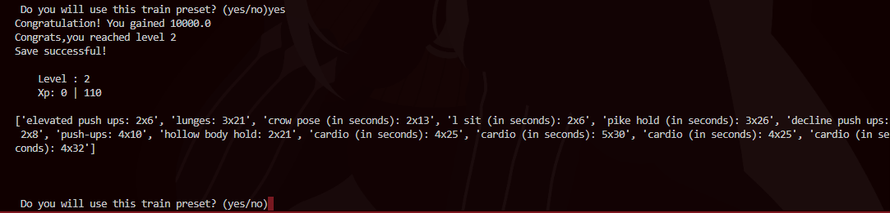

<!DOCTYPE html>
<html lang="eng">
<head>
  <meta charset="UTF-8">

  
<body>

  <header>
    <h2>V3 Update! 9/12/2026</h2> 
NEW: 

    <ul>
      <li>Enviroitment Variables: Now Data about train is hidden by and .env file that hosts whatever you want (Database,txt,JSON,etc).</li>
    </ul>
    <h1>Exercise Tracker 🏃‍♂️💪</h1>
    
<em>Auto Script for help you Plan,View and Random Select Your next Exercises!</em>

    
  </header>

  <section id="about">
    <h2>About the Project</h2>
    

      This Project uses data of exercises for create an automatic train.some features in exercises-data
      controls how the machine select them,respecting the reality of user.the project also have a experience tracker -basically,a rpg character tracking all your training process. 
    

  
  </section>

  <section id="funcs">
    <h2>Funcs</h2>
    <ul>
      <li>📅 Random Select Exercises according personal preferences and configs</li>
      <li>✅ Register of each train</li>
      <li>⏰ Time register for each train</li>
      <li>👥 Personal progress based game levels and exp</li>
    </ul>
  </section>

  <section id="tecs">
    <h2>Tecs Used</h2>
    <ul>
      <li>Python</li>
      <li>Files Handling with Python</li>
      <li>Txt files for save Informations</li>
    </ul>
  </section>

  <section id=" Instaling and Using">
    <h2>How Use?</h2>
    
I'm still did't make commands for use this as a simple program.so you'll need run the script in this way: 

    <pre>

### 1.Download or Clone that repo to your Ide 

### 2.Install requiremets (There's Nothing in V2< version):
pip install -r requirements.txt

### 4.Enter on Directory that you put the Script and:

#### 4.1.Run the Script:
  python app.py

#### 4.2.You will see this on your terminal:
    
  </pre>
    
 After it,Your train_preset on <code>Train_preset</code>will be created.you can confirm for save on history and save your progress atributes on <code>Stats.txt</code> and <code>Char_save.txt</code> respectively.

</section>

  <footer>
    
Created by Rossw
